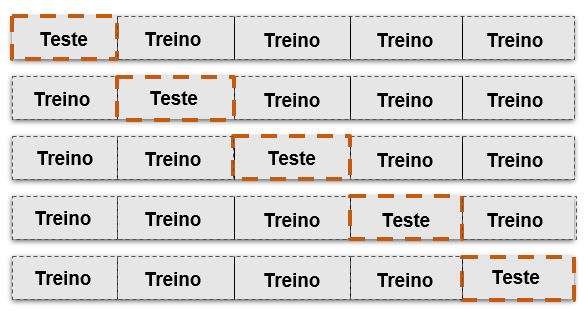

```{r, results="asis", echo=FALSE, message=FALSE, warning=FALSE}
knitr::opts_chunk$set(echo = TRUE, fig.align = "center", cache=FALSE)
suppressPackageStartupMessages({
library(DT)
library(flexdashboard)
library(tidyverse)
library(scales)
library(patchwork)
library(tidyr)
library(ggrepel)
library(janitor)
library(plotly)
library(kableExtra)
library(tm)
library(tidytext)
library(wordcloud2)
library(gdata)
})
```


```{css, warning=TRUE, echo=FALSE}
p
{
text-align: justify;
}


.bg-primary {
    color: #fff;
    background-color: #04498c;
}

.value-box .caption {
    font-size: 18px;
}

body {
    font-family: "Helvetica Neue",Helvetica,Arial,sans-serif;
    font-size: 14px;
    line-height: 1.42857143;
   /* color: #ffffff; */
    background-color: #ffffff;
}

p.value{
 color: #ffffff; 
}


.value-box .icon i {
    position: absolute;
    top: 15px;
    right: 15px;
    font-size: 80px;
    color: rgb(255 252 252 / 49%);
}

h1, .h1, h4, .h4, h5,.h5{
    font-family: "Helvetica Neue",Helvetica,Arial,sans-serif;
    font-weight: 500;
    line-height: 1.2;
    color: #ffffff;
}
```

```{r text, warning=TRUE, include=FALSE}
options(OutDec= ",")
```

# Visão geral {data-icon="fa-globe"}

## Row {data-height="130"}


### 

```{r, echo=FALSE, warning=FALSE}
valueBox(value = "Autores:",caption = "<h4>Ariane Hayana Thomé de Farias<br>Jhonnata Bezerra de Carvalho<br><br><hr><i>Machine learning e análise estatística de formas: uma aplicação no espaço tangente</i><br><br><b></h4><h5>Palavras Chave:</b> Pré-formas, Machine Learning, Coordenadas tangentes.</h5>",color = "#04488a")
```


## Row {data-height="80"}

### 

```{r, echo=FALSE, warning=FALSE}
valueBox(value = "Resumo:", color = "#04488a", caption = "<h5>Com o avanço das ferramentas computacionais, a análise estatística de formas (Statistical Shape Analysis) tem possibilitado o estudo das formas geométricas de objetos, com aplicações em áreas como medicina, biologia, arqueologia, geografia, bem como em procedimentos de reconhecimento facial e diagnóstico de doenças por meio de ressonâncias magnéticas, entre outras áreas (DRYDEN; MARDIA, 2016). Este trabalho apresenta aplicações no espaço tangente de métodos da análise estatística de formas utilizando aprendizado de máquina para a classificação de objetos bidimensionais, com objetivos de: (1) identificar padrões intrínsecos através da classificação de objetos no contexto da análise estatística de formas; (2) utilizar algoritmos de classificação em dados simulados, bem como aplicá-los em quatro bancos de dados reais; (3) avaliar a performance dos modelos.Para tanto, foram utilizados os classificadores SVM (support vector machine), ADF (análise discriminante de Fisher), Árvore de decisão, Floresta aleatória e XGBoost.</h5>")
```

# Simulações {data-icon="fa-spinner"}

## Row {data-height="250"}

### Informações

-   Nº de amostras: 100
-   Método de validação cruzada *k-fold*: dados divididos em $k$ partes e as partes $k-1$ serão de *treino* e a parte que sobra será *teste* para validar o modelo (HASTIE et al., 2009).
-   Partições: k = 5
-   Espaço tangente: projeção no plano tangente
-   Variâncias ($\sigma^2$): 0,001, 0,005, 0,009, 0,01, 0,014,0,018 e 0,02;
- Classificadores: *Support Vector Machine (SVM)*, *Árvores de decisão*, *Florestas aleatórias*, *Análise Discriminante de Fisher (ADF)* e *eXtreme Gradient Boosting (XGBoost)*.

### **Método** *k-fold*

Considere $k = 5$:<br>

{width="50"}

## Row {data-height="350"}

### Formas médias de triângulos

```{r, echo = FALSE, dpi=500, out.width="100%"}
# > Criando a forma média de um triângulo --------------------------------------------------
x<-c(1,2,1.5)
y<-c(1,1,2)

# Matriz A
A1<-cbind(x,y)

par(mar = c(2,2.5,2,2))
plot(x,y,ylim=c(0,2.5),xlim=c(0,2.5), type = "n",
     xlab = "", ylab = "",
     xaxt = "n", yaxt = "n",
     cex=2.5,cex.axis=1.5,
     bty = "n",
     cex.main=0.5)
box(bty = "l")
axis(side = 1)
axis(side = 2,
     las = 1)

points(x,y,pch=16, cex=2.5)
joinline = c(1,2,3,1)
lines(A1[joinline,], lty=2,cex=2.5, lwd = 2.5)


# Grupo 2 -----------------------------------------------------------------

# > Criando a forma média de um triângulo-----------------------------------------
A2<- A1+0.1
A2[1,]<-c(0.9,1.1)
points(A2,col=2,cex=2.5,cex.axis=1.5,pch=16)
lines(A2[joinline,],col=2, lty=2, cex=2.5,lwd = 2.5)
legend(x = "topright", col=c(1,2),
       legend=c("Grupo 1", "Grupo 2"),
       lty = c(1,2),bty="n",lwd = 1.5)

```


### Resultados

```{r, echo=FALSE}
library(readxl)
library(kableExtra)
data_sim <- read_excel("C:/Projects/TCC-UFAM/TCC-UFAM/Simulações/data-sim.xlsx")

colnames(data_sim) <- c("Classificador","0,001", "0,005", "0,009", "0,01", "0,014","0,018", "0,02")

kbl(data_sim, caption = "Tabela 1 - Acurácia (%) por classificador pelo método *k-fold.*") |> 
kable_classic(bootstrap_options = c("striped", "hover", "condensed", "responsive")) |> 
  add_header_above(c(" ", "$\\sigma^2$" = 7))
```

# Aplicações {data-icon="fa-area-chart"}

## Row 

### Vértebras de camundongos

```{r echo=FALSE, out.height="70%", out.width="80%", dpi=300}

library(shapes)
data(mice)

# Separando grupos
ratos_grandes <- mice$x[,,mice$group=="l"]
ratos_pequenos <- mice$x[,,mice$group=="s"]

# Obtendo a estimativa da forma média 
grandes_pr <- procrustes2d(ratos_grandes)
pequenos_pr <- procrustes2d(ratos_pequenos)

# Extraindo a forma média do pacote shapes
media_grandes <- grandes_pr$mshape
media_pequenos <- pequenos_pr$mshape

# Dados comparativos
dados_ratos <- data.frame(Grandes = media_grandes,
                        Pequenos = media_pequenos)

par(mar = c(2, 2, 1, 1))
joinline <- c(1,6,2:5,1)
plot(media_grandes,pch=16,ylim=c(-0.5,0.5), ylab = " ", xlab = " ")
lines(media_grandes[joinline,], lty=2, lwd = 1.5)
points(media_pequenos,pch=16,col=2)
lines(media_pequenos[joinline,], lty=2, lwd = 1.5, col=2)
legend(x = "topright", col=c(1,2,3),
       legend=c("Grande", "Pequeno"),lty = c(1,2),bty="n")
```

> Formas médias para os grupos *grande* e *pequeno*.

### Esquizofrenia

```{r echo=FALSE, out.height="100%", out.width="100%", dpi=500}
library(shapes)
data(schizophrenia)

# Separando grupos
controle <- schizophrenia$x[,,schizophrenia$group=="con"]
paciente <- schizophrenia$x[,,schizophrenia$group=="scz"]

# Obtendo a estimativa da forma média 
c_sqz <- procrustes2d(controle)
p_sqz <- procrustes2d(paciente)

# Extraindo a forma média do pacote shapes
media_controle <- c_sqz$mshape
media_paciente <- p_sqz$mshape

# Dados comparativos
dados_sqz <- data.frame(Controle = media_controle,
                        Paciente = media_paciente)


par(mar = c(2, 2, 1, 1))
joinline <- c(5,4,3,2,12,11,1,13,9,10,8,7,6,5)
plot(media_controle,pch=16,ylim=c(-0.5,0.5))
lines(media_controle[joinline,], lty=2, lwd = 1.5, col=1)
points(media_paciente,pch=16,col=2)
lines(media_paciente[joinline,], lty=2, lwd = 1.5, col=2)
legend(x = "topright", col=c(1,2),
       legend=c("Controle", "Paciente"),lty = c(1,2),bty="n")

```

> Formas médias do grupo *controle* e *paciente*.

### Gorilas

```{r echo=FALSE, out.height="100%", out.width="100%", dpi=500}
library(shapes)
data(apes)

# Separando grupos
primata_1 <- apes$x[,,apes$group=="gorf"]
primata_2 <- apes$x[,,apes$group=="gorm"]

# Obtendo a estimativa da forma média 
pr_primata_1 <- procrustes2d(primata_1)
pr_primata_2 <- procrustes2d(primata_2)

# Extraindo a forma média do pacote shapes
media_pr_1 <- pr_primata_1$mshape
media_pr_2 <- pr_primata_2$mshape

# Dados comparativos
dados_medias_pr <- data.frame(Primata_1 = media_pr_1,
                         Primata_2 = media_pr_2)
par(mar = c(2, 2, 1, 1))
joinline <- c(1,5,4,3,2,8,7,6,1)
plot(media_pr_1,pch=16,ylim=c(-0.5,0.5),ylab = " ", xlab = " ")
lines(media_pr_1[joinline,], lty=2, lwd = 1.5, col=1)
points(media_pr_2,pch=16,col=2)
lines(media_pr_2[joinline,], lty=2, lwd = 1.5, col=2)
legend(x = "topright", col=c(1,2),
       legend=c("Fêmea", "Macho"),lty = c(1,2),bty="n")
```

> Formas médias de crânios de gorilas *machos* e *fêmeas*.

### Crânios de ratos

```{r echo=FALSE, out.height="100%", out.width="100%", dpi=500}
library(shapes)
data(rats)

# Separando por dias
ratos_7 <- rats$x[,,rats$time=="7"]
ratos_150 <- rats$x[,,rats$time=="150"]

# Obtendo a estimativa da forma média 
ratos7_pr <- procrustes2d(ratos_7)
ratos150_pr <- procrustes2d(ratos_150)

# Extraindo a forma média do pacote shapes
media_7 <- ratos7_pr$mshape
media_150 <- ratos150_pr$mshape

# Dados comparativos
dados_rats <- data.frame(Dia7 = media_7,
                          Dia150 = media_150)

par(mar = c(2, 2, 1, 1))
joinline <- c(1:8,1)
plot(media_7,pch=16,ylim=c(-0.5,0.5),ylab = " ", xlab = " ")
lines(media_7[joinline,], lty=2, lwd = 1.5)
points(media_150,pch=16,col=2)
lines(media_150[joinline,], lty=2, lwd = 1.5, col=2)
legend(x = "topleft", col=c(1,2,3),
       legend=c("Dia 7", "Dia 150"),lty = c(1,2),bty="n")
```


> Formas médias de crânios de ratos no 7º e 150º dias.

## Row 

### Descrição 

-	<font size="1.9"><div style="text-align: justify">**Vértebras de camundongos**: Possui 6 marcos para cada um dos 46 camundongos dos grupos grande e pequeno. Dados utilizados para avaliar os efeitos do peso corporal sobre a forma das vértebras de camundongos *grandes* e *pequenos*;</font></div>
- <font size="1.9"><div style="text-align: justify">**Esquizofrenia**: Dados cerebrais coletados de ressonâncias magnéticas de voluntários e pacientes esquizofrênicos com intuito de identificar quaisquer diferenças entre o grupo de *controle* e o grupo de *pacientes*. Trata-se de coordenadas bidimensionais com 13 marcos para cada um dos 28 indivíduos; </font></div>
-	<font size="1.9"><div style="text-align: justify">**Crânios de Gorilas**: Dados cranianos de gorilas de modo a avaliar as diferenças entre crânios por espécies e sexo, com 8 marcos para cada um dos 59 primatas;</font></div>
-	<font size="1.9"><div style="text-align: justify">**Crânios de ratos**: Dados extraídos de raios-X cranianos de ratos. Em cada radiografia foram identificados 8 marcos para cada idade de crescimento. Com intuito de analisar as mudanças entre o início e o fim das etapas de crescimento, avaliou-se os dias 7 e 150.</font></div>

### Resultados

```{r, echo=FALSE}
library(readxl)
library(kableExtra)
data_app <- read_excel("C:/Projects/TCC-UFAM/TCC-UFAM/Aplicações/data_app.xlsx")

kbl(data_app, caption = "Tabela 2 - Acurácia dos bancos de dados por classificador pelo método *leave-one-out*.") |>
kable_classic(bootstrap_options = c("striped", "hover", "condensed", "responsive")) |>
  add_header_above(c(" ", "Acurácia (%)" = 4))
```


# Referências {data-icon="fa-book"}

### Referências 

DRYDEN, I. L. *Shapes package*. Vienna, Austria, 2021. Contributed package, Version 1.2.6. Disponível em: <http://www.R-project.org>.

DRYDEN, I. L.; MARDIA, K. V. **Statistical Shape Analysis with applications in R**. [S.l.]: John Wiley & Sons, 2016.<br>

HASTIE, T.; TIBSHIRANI, R.; FRIEDMAN, J. H.; FRIEDMAN, J. H. **The elements of statistical learning: data mining, inference, and prediction.** [S.l.]: Springer, 2009. v. 2.<br>

KENDALL, D. G. Shape manifolds, procrustean metrics, and complex projective spaces. **Bulletin of the London mathematical society**, Wiley Online Library, v. 16, n. 2, p. 81--121, 1984.<br>

R Core Team. R: *A Language and Environment for Statistical Computing*. Vienna, Austria, 2022. Disponível em: <https://www.R-project.org/>.
